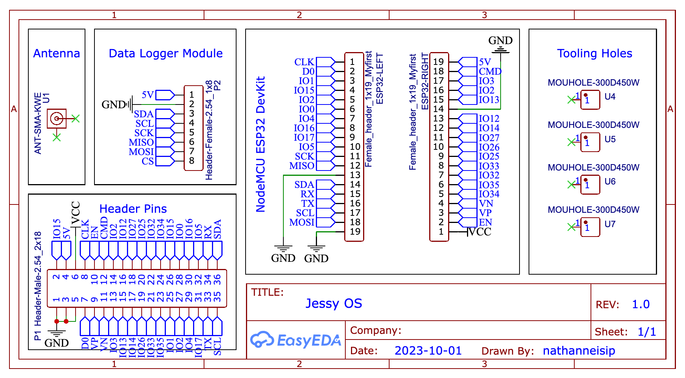
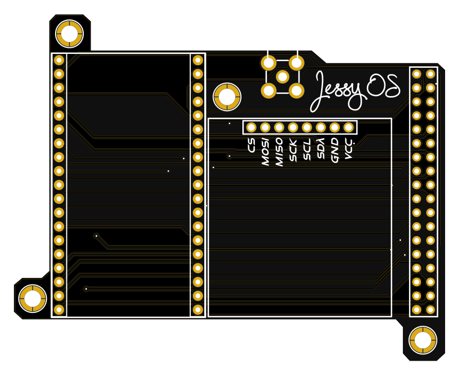
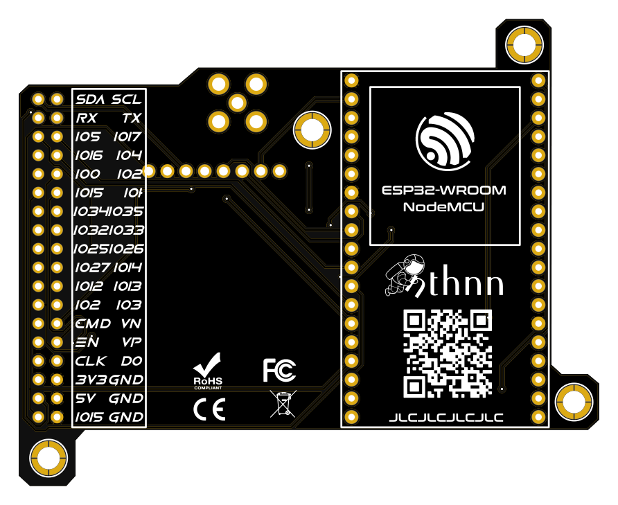

<p align="center">
    
    
</p>
<h1 align="center">Jessy OS</h1>


[](https://ohwr.org/cern_ohl_s_v2.pdf)
[](https://opensource.org/licenses/MIT)

Jessy OS is an embedded operating system designed for the ESP32 microcontroller. It provides a versatile platform for various IoT and embedded systems projects, with features like a file system, real-time clock support, networking capabilities, user accounts, and JavaScript execution via the embedded Duktape VM.

<p align="center">
    
</p>

## Table of Contents

* [Features](#features)
* [Getting Started](#getting-started)
    - [Components](#components)
    - [Flashing the OS](#flashing-the-os)
    - [Running](#running)
* [Hardware Setup](#hardware-setup)
    - [Schematic Diagram](#schematic-diagram)
    - [PCB Preview](#pcb-preview)
* [Documentations](#documentations)
* [Contributions](#contributions)
    - [Issue Reporting](#issue-reporting)
    - [Pull Requests](#pull-requests)
* [Contributors](#contributors)
* [To-do](#to-do)
* [Known Bugs](#known-bugs)
* [License](#license)

## Features

- **File System**: Jessy OS includes its own file system, allowing you to manage and access files on the ESP32 device.
- **Real-Time Clock (RTC)**: It supports the DS1307 real-time clock via I2C, enabling accurate timekeeping for your applications.
- **User Accounts**: You can create and manage multiple user accounts, making it suitable for applications requiring user authentication.
- **Networking**: Jessy OS includes networking functionality with a WLAN command for managing Wi-Fi connections and network configurations.
- **JavaScript Support**: The embedded Duktape VM allows you to execute JavaScript programs, expanding the range of applications you can build.

## Getting Started

This steps should be followed if intended just to be a prototype or experimental.

### Components

Before getting started with Jessy OS, you'll need the following:

- An ESP32 microcontroller.
- A compatible SD card adapter module for file system support.
- A DS1307 real-time clock module connected via I2C.

After gathering the aforementioned components, connect it as follows:

<table align="center">
    <thead>
        <tr>
            <td>Component</td>
            <td>ESP32</td>
        </tr>
    </thead>
    <tbody>
        <tr>
            <td colspan="2" align="center">SD Card</td>
        </tr>
        <tr>
            <td>VCC</td>
            <td>VCC</td>
        </tr>
        <tr>
            <td>GND</td>
            <td>GND</td>
        </tr>
        <tr>
            <td>CS</td>
            <td>GPIO5</td>
        </tr>
        <tr>
            <td>MOSI</td>
            <td>GPIO23</td>
        </tr>
        <tr>
            <td>MISO</td>
            <td>GPIO19</td>
        </tr>
        <tr>
            <td>SCK</td>
            <td>GPIO18</td>
        </tr>
        <tr>
            <td colspan="2" align="center">DS1307 RTC</td>
        </tr>
        <tr>
            <td>VCC</td>
            <td>VCC</td>
        </tr>
        <tr>
            <td>GND</td>
            <td>GND</td>
        </tr>
        <tr>
            <td>SDA</td>
            <td>SDA</td>
        </tr>
        <tr>
            <td>SCL</td>
            <td>SCL</td>
        </tr>
    </tbody>
</table>

### Flashing the OS

1. Clone the Jessy OS repository.

    ```bash
    git clone https://github.com/nthnn/Jessy-OS.git
    ```

2. Open the clone repository via PlatformIO extension on VS Code.
3. Plug your board in, and then press the upload button on the status bar of VS Code.
4. Enjoy!

### Running

Communication to Jessy OS can be done through UART serial communication, which means, it just needs to be connected to the USB port (e.g. via CH340, PL2302, etc).

1. Connect the ESP32 (e.g. ESP32 DevKit 1.0 or the JessyOS PCB) board to USB port.
2. Open the `jsym`. Program dedicated for communicating with Jessy OS via UART.
3. Press the reset button on ESP32 DevKit board.

## Hardware Setup

1. Download the Gerber file from folder [pcb_files](pcb_files).
2. Go to [JLCPCB](https://jlcpcb.com/) or any of your favorite PCB manufacturer to fabricate the Jessy-OS PCB. *PS: I am not sponsored, it just happened that JLCPCB is my favorite.*
3. After soldering all the necessary components (ESP32 NodeMCU DevKit, DFRobot Data Logger, header pins, and the SMA Female 4-pin antenna port with pigtail), you can now proceed to [flashing the OS](#flashing-the-os) to Jessy OS.
4. Copy the folder [sd](/sd) to your SD card that will be using on Jessy OS. Do not forget to delete the `removethisfile` files inside each folder.

### Schematic Diagram



> Note: The data logger module used in the schematic diagram is the same board produced by Deek-Robot, which consist of microSD adapter and DS1307 real-time clock (See [here](https://www.twinschip.com/Data-Logging-Module-RTC-and-micro-SD-Card)).

### PCB Preview

| Jessy OS PCB Front                             | Jessy OS PCB Back                            |
|------------------------------------------------|----------------------------------------------|
|  |  |

## Documentations

The documentation includes documentation on how Jessy OS works, the available terminal commands, and the JavaScript APIs.

<p align="center">
	<a href="https://jessy-os.vercel.app/"></a>
</p>

## Contributions

Contributions and feedback are all welcome to enhance this library. If you encounter any issues, have suggestions for improvements, or would like to contribute code, please do so.

### Issue Reporting

If you encounter a bug, have a feature request, or want to suggest improvements, please open an issue on the [GitHub Issue Tracker](https://github.com/nthnn/Jessy-OS/issues). Be sure to provide as much detail as possible, including steps to reproduce the issue if applicable.

### Pull Requests

If you want to contribute to Jessy OS, follow these steps:

1. Fork the Jessy OS repository to your GitHub account. And then clone it to your local machine.

    ```bash
    git clone https://github.com/<your username>/Jessy-OS.git
    ```

2. Create a new branch for your changes:

    ```bash
    git checkout -b feature/<your feature name>
    ```

3. You can now make changes to the repository.
4. Commit your changes:

    ```bash
    git add -A
    git commit -m "Add your meaningful commit message here"
    ```

5. Push your changes to your forked repository:

    ```bash
    git push origin feature/<your feature name>
    ```

6. Create a pull request (PR) from your branch to the main branch of the Jessy OS repository.
7. Your PR will be reviewed, and any necessary changes will be discussed and implemented.
8. Once your PR is approved, it will be merged into the main branch, and your contribution will be part of Jessy OS.

## Contributors

- [Nathanne Isip](https://github.com/nthnn) - Original Author, Developer
- [Lady Selene](https://instagram.com/lady.selenee) - Logo designer (Jessy OS is named after her)

## To-do

1. Improve the available APIs on the JavaScript Duktape VM.
2. Terminal command for editing files.

## Known Bugs

1. The `wget` command only works on HTTP non-secure hosts/targets.

    (See line [#957](#) of [src/jessy_terminal.cpp](src/jessy_terminal.cpp))

## License

Jessy OS has two (2) license. The hardware itself (including the PCB Gerber files and the schematic diagram) is under the CERN Open Hardware Licence Version 2 - Strongly Reciprocal, while the Jessy OS repository as a whole is under MIT Public License.

Both licenses have distinct characteristics and implications.

The CERN Open Hardware License (CERN OHL) is designed to facilitate the sharing and collaboration of open hardware designs. The CERN v2 Strong license places an emphasis on ensuring modifications to the original hardware design remain open and under the same license. It promotes the sharing of derivative works and requires contributors to provide proper attribution.

The MIT License is one of the most permissive open-source licenses. It allows others to use, modify, distribute, and even incorporate your code into proprietary projects. Users of MIT-licensed software typically have fewer restrictions, making it a widely adopted license for software libraries and components.